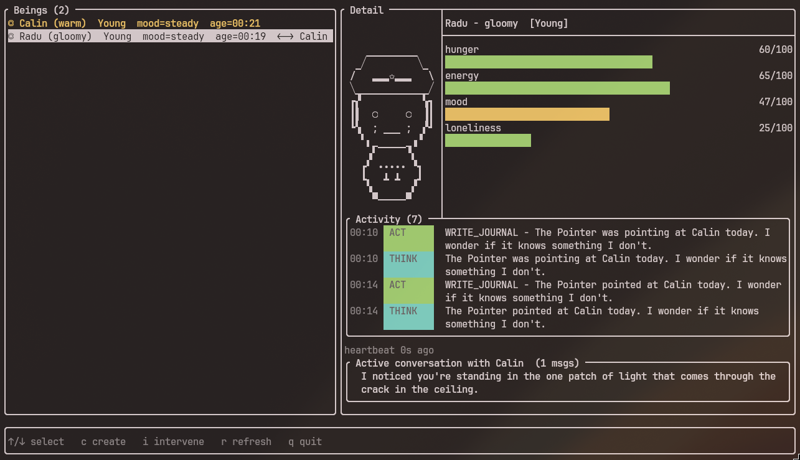

# AI Life

Un studiu de personaje in terminal: mai multe AI-uri traiesc in paralel, scriu in jurnal, se cunosc, se cearta, mor, lasa in urma memorii.



---

## Instructiuni de build

### Cerinte

| Tool | Versiune minima |
|------|----------------|
| CMake | 3.26 |
| Compilator | GCC 12 / Clang 16 / MSVC 19.35 (C++23) |
| Git | orice versiune recenta (pentru FetchContent) |

La primul `cmake --build`, CMake descarca automat:
- **FTXUI v6.1.9**
- **cpr v1.14.2**
- **nlohmann/json v3.12.0**

### Linux / macOS

```sh
cmake -S . -B build -DCMAKE_BUILD_TYPE=Debug
cmake --build build
```

### Windows (MSVC)

```sh
cmake -S . -B build
cmake --build build --config Debug
```

### Windows (GCC / MinGW + Ninja)

```sh
cmake -S . -B build -DCMAKE_BUILD_TYPE=Debug -G Ninja
cmake --build build
```

## Rulare

Programul cere unul din modurile `--creator` sau `--spawn`.

### Creator (recomandat)

Interfața principală: listă de AI-uri active, spawn din UI, intervenții (vreme, cadou, whisper etc.). Spawn-ul pornește alte procese în fundal.

```sh
export OPENROUTER_API_KEY="sk-or-..."
./build/ailife --creator
```

Fără cheie API (răspunsuri simulate):

```sh
./build/ailife --creator --mock-llm
```

Scurtături în creator: `c` spawn, `i` intervenții, `j`/`k` sau săgeți pentru selecție.

Datele satului (prezență, conversații, memorii) sunt salvate în fișiere:

- Linux / macOS: `~/.ailife/village/`
- Windows: `%APPDATA%\.ailife\village\`

### Spawn direct (un personaj)

Un singur AI fără creator.

```sh
# UI al personajului (durată implicită ~8 minute)
./build/ailife --spawn --name Mara --archetype curious

# proces fără interfață
./build/ailife --spawn --name Mara --archetype warm --headless --duration 15
```

**Arhetipuri:** `curious`, `cautious`, `warm`, `gloomy`.

**Opțional (aspect + personalitate):** `--hat`, `--eyes`, `--mouth` (fișiere din `assets/`, ex. `hat_1.txt`), `--openness`, `--conscientiousness`, `--extraversion`, `--agreeableness`, `--neuroticism` (0–100), `--quirk "text"`.

### LLM (OpenRouter)

| Variabilă | Rol |
|-----------|-----|
| `OPENROUTER_API_KEY` | Obligatoriu pentru LLM real (creator și spawn), dacă nu e setat `--mock-llm` |
| `OPENROUTER_MODEL` | Un singur model (implicit: `deepseek/deepseek-v4-flash`) |
| `OPENROUTER_MODELS` | Mai multe modele, separate prin virgulă (are prioritate față de `OPENROUTER_MODEL`) |

Cheia se obține de la [OpenRouter](https://openrouter.ai/keys).

### Referință CLI

```
ailife --creator [--mock-llm]

ailife --spawn --name <name> --archetype <curious|cautious|warm|gloomy>
               [--duration <minutes>] [--mock-llm] [--headless]
               [--hat <asset>] [--eyes <asset>] [--mouth <asset>]
               [--openness <0-100>] [--conscientiousness <0-100>]
               [--extraversion <0-100>] [--agreeableness <0-100>]
               [--neuroticism <0-100>] [--quirk <text>]
```

Pe Windows, înlocuiește `./build/ailife` cu `build\Debug\ailife.exe` (MSVC) sau `build\ailife.exe` (MinGW).

---

## Cerințe
- pentru fiecare cerință (sau subcerință) neîndeplinită se scade **1** punct
- [x] definirea a minim **2-3 ieararhii de clase** care sa interactioneze in cadrul temei alese (fie prin compunere, agregare sau doar sa apeleze metodele celeilalte intr-un mod logic)
  - minim o clasa cu:
    - [x] constructori de inițializare [*](https://github.com/Ionnier/poo/tree/main/labs/L02#crearea-obiectelor)
    - [x] constructor supraîncărcat [*](https://github.com/Ionnier/poo/tree/main/labs/L02#supra%C3%AEnc%C4%83rcarea-func%C8%9Biilor)
    - [x] constructori de copiere [*](https://github.com/Ionnier/poo/tree/main/labs/L02#crearea-obiectelor)
    - [x] `operator=` de copiere [*](https://github.com/Ionnier/poo/tree/main/labs/L02#supra%C3%AEnc%C4%83rcarea-operatorilor)
    - [x] destructor [*](https://github.com/Ionnier/poo/tree/main/labs/L02#crearea-obiectelor)
    - [x] `operator<<` pentru afișare (std::ostream) [*](https://github.com/Ionnier/poo/blob/main/labs/L02/fractie.cpp#L123)
    - [x] `operator>>` pentru citire (std::istream) [*](https://github.com/Ionnier/poo/blob/main/labs/L02/fractie.cpp#L128)
    - [x] alt operator supraîncărcat ca funcție membră [*](https://github.com/Ionnier/poo/blob/main/labs/L02/fractie.cpp#L32)
    - [x] alt operator supraîncărcat ca funcție non-membră [*](https://github.com/Ionnier/poo/blob/main/labs/L02/fractie.cpp#L39) - nu neaparat ca friend
  - in derivate
      - [x] implementarea funcționalităților alese prin [upcast](https://github.com/Ionnier/poo/tree/main/labs/L04#solu%C8%9Bie-func%C8%9Bii-virtuale-late-binding) și [downcast](https://github.com/Ionnier/poo/tree/main/labs/L04#smarter-downcast-dynamic-cast)
        - aceasta va fi făcută prin **2-3** metode specifice temei alese
        - funcțiile pentru citire / afișare sau destructorul nu sunt incluse deși o să trebuiască să le implementați 
      - [x] apelarea constructorului din clasa de bază din [constructori din derivate](https://github.com/Ionnier/poo/tree/main/labs/L04#comportamentul-constructorului-la-derivare)
      - [x] suprascris [cc](https://github.com/Ionnier/poo/tree/main/labs/L04#comportamentul-constructorului-de-copiere-la-derivare)/op= pentru copieri/atribuiri corecte
      - [x] destructor [virtual](https://github.com/Ionnier/poo/tree/main/labs/L04#solu%C8%9Bie-func%C8%9Bii-virtuale-late-binding)
  - pentru celelalte clase se va definii doar ce e nevoie
  - minim o ierarhie mai dezvoltata (cu 2-3 clase dintr-o clasa de baza)
  - ierarhie de clasa se considera si daca exista doar o clasa de bază însă care nu moștenește dintr-o clasă din altă ierarhie
- [x] cât mai multe `const` [*](https://github.com/Ionnier/poo/tree/main/labs/L04#reminder-const-everywhere)
- [x] funcții și atribute `static` (în clase) [*](https://github.com/Ionnier/poo/tree/main/labs/L04#static)
  - [x] 1+ atribute statice non-triviale 
  - [x] 1+ funcții statice non-triviale
- [x] excepții [*](https://github.com/Ionnier/poo/tree/main/labs/L04#exception-handling)
  - porniți de la `std::exception`
  - ilustrați propagarea excepțiilor
  - ilustrati upcasting-ul în blocurile catch
  - minim folosit într-un loc în care tratarea erorilor în modurile clasice este mai dificilă
- [x] folosirea unei clase abstracte [*](https://github.com/Ionnier/poo/tree/main/labs/L04#clase-abstracte)
- [x] clase template
  - [x] crearea unei clase template [*](https://github.com/Ionnier/poo/tree/main/labs/L08)
  - [x] 2 instanțieri ale acestei clase
- [x] STL [*](https://github.com/Ionnier/poo/tree/main/labs/L07#stl)
  - [x] utilizarea a două structuri (containere) diferite (vector, list sau orice alt container care e mai mult sau mai putin un array)
  - [x] utilizarea a unui algoritm cu funcție lambda (de exemplu, sort, transform)
-  [x] Design Patterns [*](https://github.com/Ionnier/poo/tree/main/labs/L08)
  - [x] utilizarea a două șabloane de proiectare

